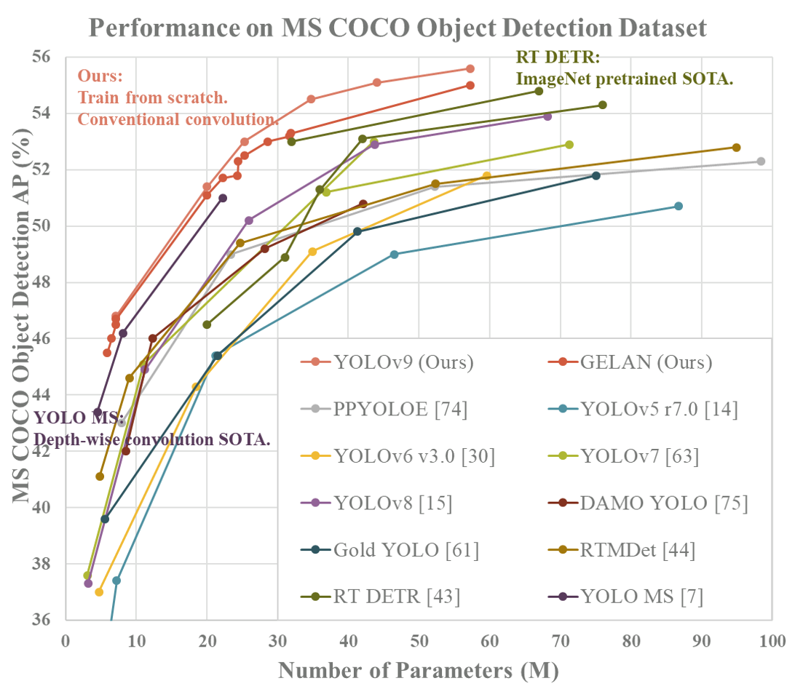

# Vehicle Counting Using YOLOV9 + DeepSort

## Method
- Using YOLOV9 for Object Detection
  
    Implementation of paper - [YOLOv9: Learning What You Want to Learn Using Programmable Gradient Information](https://arxiv.org/abs/2402.13616)
  
    Source Code: - [https://github.com/WongKinYiu/yolov9](https://github.com/WongKinYiu/yolov9)

<div align="center">
    <a href="./">
        
    </a>
</div>

- Using deep-sort-realtime to track vehicles by assigning a unique ID to each vehicle in every frame it appears in.

<div align="center">
    <a href="./">
        
    </a>
</div>

## Pretrain Weights 

MS COCO

| Model | Test Size | AP<sup>val</sup> | AP<sub>50</sub><sup>val</sup> | AP<sub>75</sub><sup>val</sup> | Param. | FLOPs |
| :-- | :-: | :-: | :-: | :-: | :-: | :-: |
| [**YOLOv9-T**](https://github.com/WongKinYiu/yolov9/releases/download/v0.1/yolov9-t-converted.pt) | 640 | **38.3%** | **53.1%** | **41.3%** | **2.0M** | **7.7G** |
| [**YOLOv9-S**](https://github.com/WongKinYiu/yolov9/releases/download/v0.1/yolov9-s-converted.pt) | 640 | **46.8%** | **63.4%** | **50.7%** | **7.1M** | **26.4G** |
| [**YOLOv9-M**](https://github.com/WongKinYiu/yolov9/releases/download/v0.1/yolov9-m-converted.pt) | 640 | **51.4%** | **68.1%** | **56.1%** | **20.0M** | **76.3G** |
| [**YOLOv9-C**](https://github.com/WongKinYiu/yolov9/releases/download/v0.1/yolov9-c-converted.pt) | 640 | **53.0%** | **70.2%** | **57.8%** | **25.3M** | **102.1G** |
| [**YOLOv9-E**](https://github.com/WongKinYiu/yolov9/releases/download/v0.1/yolov9-e-converted.pt) | 640 | **55.6%** | **72.8%** | **60.6%** | **57.3M** | **189.0G** |
<!-- | [**YOLOv9 (ReLU)**]() | 640 | **51.9%** | **69.1%** | **56.5%** | **25.3M** | **102.1G** | -->

<!-- tiny, small, and medium models will be released after the paper be accepted and published. -->
## Requirements
- cuda
- Pytorch
- deep-sort-realtime
- opencv-python
- numpy 

</details>

## Running Code
``` shell
# evaluate converted yolov9 models
python object_tracking.py
```

You will get the results:


